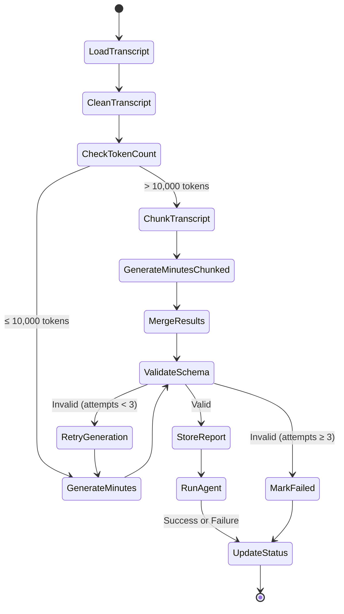
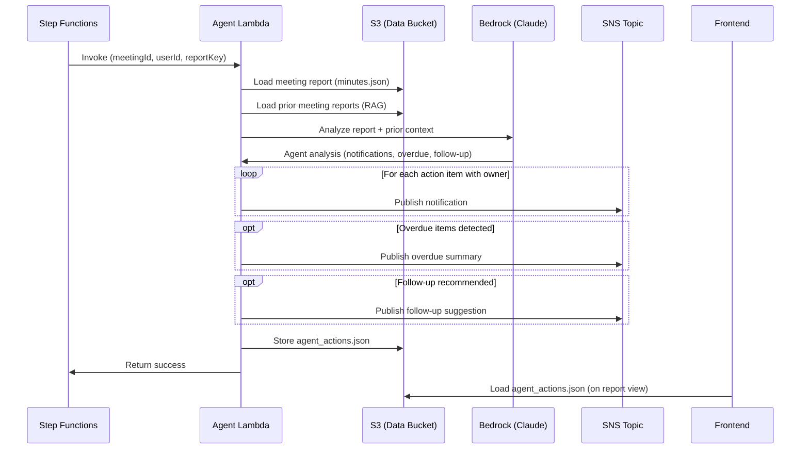

# Design Document: Bedrock Agent for Post-Meeting Actions

## Overview

This document describes the technical design for a Bedrock-powered post-meeting agent that autonomously processes generated meeting minutes and takes follow-up actions. The agent is implemented as a Lambda function invoked by Step Functions after the report is stored, using Amazon Bedrock for intelligent analysis and Amazon SNS for notifications.

### Key Design Decisions

1. **Lambda + Bedrock (not Bedrock Agents service)**: We use a Lambda function that directly invokes Bedrock's `InvokeModel` API rather than the managed Bedrock Agents service. This gives us full control over the agent's logic, avoids the complexity of Action Groups and Knowledge Bases setup, and keeps the architecture consistent with the existing Generator Lambda pattern.

2. **SNS for notifications**: SNS provides a simple, scalable notification mechanism. Initially notifications go to a single topic (email subscription). Future enhancement: per-user notification preferences, Slack/Teams integration.

3. **Non-blocking execution**: Agent failure does NOT fail the overall meeting workflow. The meeting report is already stored successfully before the agent runs.

4. **Same RAG pattern**: Reuses the S3-based prior meeting context retrieval from the Generator Lambda.

## Architecture

### Integration with Existing Step Functions Workflow



The `RunAgent` step:
- Receives the same payload as other steps (meetingId, userId, bucket, transcriptKey) plus the reportKey
- Has its own Catch block that transitions directly to `UpdateStatus` (not `MarkFailed`)
- Meeting status is set to `completed` regardless of agent success/failure

### Data Flow



## Components

### 1. Agent Lambda (`Pranav-meeting-minutes-agent`)

| Attribute | Value |
|-----------|-------|
| Runtime | Python 3.12 |
| Memory | 1024 MB |
| Timeout | 120 seconds |
| Handler | `handler.handler` |

**Environment Variables:**

| Variable | Value |
|----------|-------|
| `DATA_BUCKET` | `pranav-meeting-minutes-data` |
| `MODEL_ID` | `jp.anthropic.claude-haiku-4-5-20251001-v1:0` |
| `SNS_TOPIC_ARN` | ARN of `Pranav-meeting-minutes-notifications` |
| `MEETINGS_TABLE` | `Pranav-meeting-minutes-meetings` |

**Lambda Logic:**

```python
def handler(event, context):
    # 1. Load the generated meeting report from S3
    report = load_report(event["reportKey"])
    
    # 2. Load prior meeting context (RAG - same as generator)
    prior_context = get_prior_meeting_context(event["userId"], event["meetingId"])
    
    # 3. Invoke Bedrock to analyze the report
    analysis = analyze_with_bedrock(report, prior_context)
    
    # 4. Send action item notifications
    notifications_sent = send_action_notifications(report, analysis)
    
    # 5. Detect and report overdue items
    overdue_items = analysis.get("overdue_items", [])
    if overdue_items:
        send_overdue_notification(overdue_items, report)
    
    # 6. Generate follow-up suggestion
    follow_up = analysis.get("follow_up_suggestion")
    if follow_up:
        send_follow_up_notification(follow_up, report)
    
    # 7. Store agent report
    agent_report = {
        "notifications_sent": notifications_sent,
        "overdue_items": overdue_items,
        "follow_up_suggestion": follow_up,
        "agent_execution_timestamp": datetime.now(timezone.utc).isoformat(),
    }
    store_agent_report(event["userId"], event["meetingId"], agent_report)
    
    return {"status": "success", "agentReportKey": agent_report_key}
```

### 2. Bedrock Prompt for Agent Analysis

The agent uses a single Bedrock invocation with a structured prompt that asks Claude to:
1. Identify which action items need notifications (those with owners)
2. Compare current action items against prior meeting context to find overdue/recurring items
3. Determine if a follow-up meeting is needed

**Prompt Template** (`prompts/v1/agent_prompt.txt`):

```
You are a post-meeting action assistant. Analyze the meeting report and prior meeting context to determine follow-up actions.

## Current Meeting Report
{report_json}

## Prior Meeting Context
{prior_context}

## Today's Date
{today_date}

## Instructions

Analyze the meeting and return a JSON object with:

1. "overdue_items": Array of items from prior meetings that appear overdue or are being discussed again. Each item:
   - "original_task": the task from the prior meeting
   - "original_owner": who was assigned
   - "original_due_date": when it was due
   - "current_meeting_reference": how it came up in the current meeting
   - "status": "overdue" or "recurring"

2. "follow_up_suggestion": null if no follow-up needed, or an object:
   - "recommended": true/false
   - "reason": why a follow-up is needed
   - "suggested_topics": array of topics to cover
   - "suggested_participants": array of participant names
   - "recommended_timeframe": e.g., "within 1 week"

3. "notification_enhancements": Array of additional context to include in notifications. Each:
   - "owner": the action item owner
   - "additional_context": extra context from the meeting or prior meetings that helps the owner

Return ONLY the JSON object, no other text.
```

### 3. SNS Topic (`Pranav-meeting-minutes-notifications`)

| Attribute | Value |
|-----------|-------|
| Name | `Pranav-meeting-minutes-notifications` |
| Encryption | AWS managed key (SSE) |
| Protocol | Email (initial), expandable to Lambda/HTTP |

**Notification Message Format:**

```
Subject: [KaiNote] Action Item: {task} (Due: {due_date})
-- or --
Subject: [KaiNote] [HIGH PRIORITY] Action Item: {task} (Due: {due_date})

Body:
Meeting: {meeting_title}
Date: {meeting_datetime}

Task: {task}
Owner: {owner}
Due Date: {due_date or "Not specified"}
Priority: {priority}

Context from meeting:
"{evidence}"

{additional_context from agent analysis}

---
This notification was automatically generated by KaiNote.
```

### 4. Agent Report Schema (`agent_actions.json`)

```json
{
  "agent_execution_timestamp": "2024-01-15T11:10:00Z",
  "notifications_sent": [
    {
      "recipient": "John",
      "task": "Prepare S3 migration plan for intelligent tiering",
      "due_date": "2024-01-19",
      "priority": "high",
      "sent_at": "2024-01-15T11:10:01Z",
      "message_id": "sns-message-id"
    }
  ],
  "overdue_items": [
    {
      "original_task": "Review CloudFront cache policies",
      "original_owner": "Megan",
      "original_due_date": "2024-01-10",
      "current_meeting_reference": "CloudFront cache hit ratio still at 60%",
      "status": "overdue"
    }
  ],
  "follow_up_suggestion": {
    "recommended": true,
    "reason": "Multiple high-priority items with tight deadlines and overdue items from prior meeting",
    "suggested_topics": ["S3 migration progress", "CloudFront cache policy review"],
    "suggested_participants": ["John", "Megan", "Sarah"],
    "recommended_timeframe": "within 1 week"
  }
}
```

### 5. IAM Role (`Pranav-meeting-minutes-agent-role`)

**Permissions:**
- `s3:GetObject` on `pranav-meeting-minutes-data/users/*/reports/*/minutes.json`
- `s3:PutObject` on `pranav-meeting-minutes-data/users/*/reports/*/agent_actions.json`
- `s3:ListBucket` on `pranav-meeting-minutes-data` (prefix `users/`)
- `bedrock:InvokeModel` on the model ARN and inference profile
- `sns:Publish` on `Pranav-meeting-minutes-notifications` topic
- `logs:CreateLogGroup`, `logs:CreateLogStream`, `logs:PutLogEvents`
- Permissions boundary: `MZJTeamBoundary`

### 6. Step Functions Update

Add `RunAgent` state after `StoreReport`:

```json
"RunAgent": {
  "Type": "Task",
  "Resource": "arn:aws:lambda:ap-northeast-1:ACCOUNT:function:Pranav-meeting-minutes-agent",
  "Parameters": {
    "action": "run_agent",
    "meetingId.$": "$.meetingId",
    "userId.$": "$.userId",
    "bucket.$": "$.bucket",
    "reportKey.$": "$.reportKey"
  },
  "ResultPath": "$.agentResult",
  "Retry": [
    {
      "ErrorEquals": ["Lambda.ServiceException", "Lambda.AWSLambdaException"],
      "IntervalSeconds": 2,
      "MaxAttempts": 1,
      "BackoffRate": 2.0
    }
  ],
  "Catch": [
    {
      "ErrorEquals": ["States.ALL"],
      "ResultPath": "$.agentError",
      "Next": "UpdateStatus"
    }
  ],
  "Next": "UpdateStatus"
}
```

### 7. Frontend Changes

Add an "Agent Actions" section to the meeting report page:

- Section appears below the main report
- Glass-panel card with "🤖 Automated Actions" header
- Sub-sections:
  - **Notifications Sent**: List of notifications with recipient, task, and timestamp
  - **Overdue Items**: Warning-styled cards showing overdue tasks from prior meetings
  - **Follow-Up Suggestion**: If present, shows recommended topics and participants

The frontend loads `agent_actions.json` alongside the main report. If the file doesn't exist (agent hasn't run yet or failed), the section is hidden.

## Terraform Resources

| Resource | Terraform Name | File |
|----------|---------------|------|
| Agent Lambda | `Pranav-meeting-minutes-agent` | `infra/lambda.tf` |
| Agent IAM Role | `Pranav-meeting-minutes-agent-role` | `infra/iam.tf` |
| SNS Topic | `Pranav-meeting-minutes-notifications` | `infra/sns.tf` |
| CloudWatch Log Group | `/aws/lambda/Pranav-meeting-minutes-agent` | `infra/lambda.tf` |
| Agent Prompt | `prompts/v1/agent_prompt.txt` | `infra/s3_objects.tf` |

## Error Handling

| Scenario | Handling |
|----------|----------|
| Report not found in S3 | Log error, return gracefully. Meeting status remains "completed". |
| Bedrock invocation failure | Retry once. On final failure, store partial agent_report with error field. |
| SNS publish failure | Log error, continue with remaining notifications. Record failed notifications in agent_report. |
| Malformed Bedrock response | Log error, skip analysis-dependent actions. Send basic notifications from report data only. |
| Agent Lambda timeout | Step Functions Catch block transitions to UpdateStatus. Meeting remains "completed". |

## Testing Strategy

- Unit test: Bedrock prompt construction with various report shapes
- Unit test: SNS notification formatting (subject line, body)
- Unit test: Overdue detection logic with mock prior context
- Integration test: Full agent flow with mocked AWS services (moto)
- Manual test: End-to-end with real meetings (record 2+ meetings, verify second triggers overdue detection)
