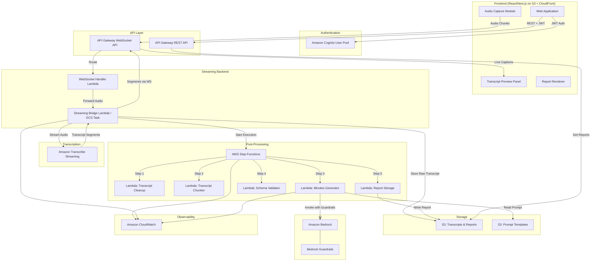
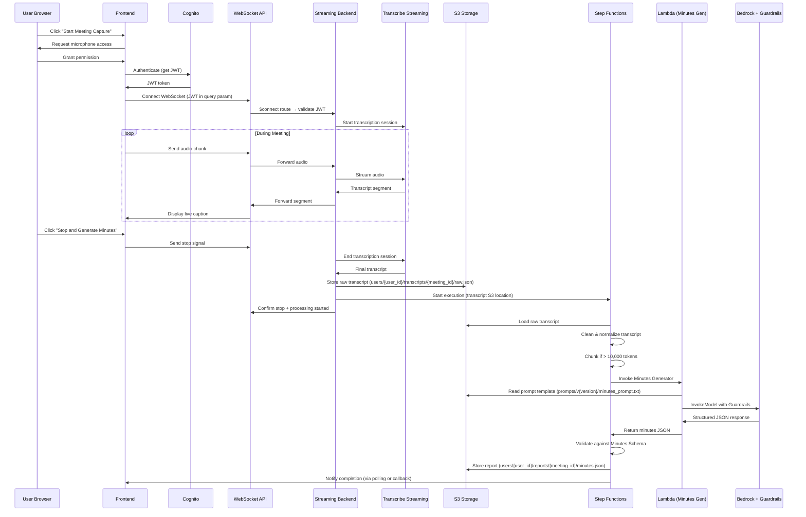
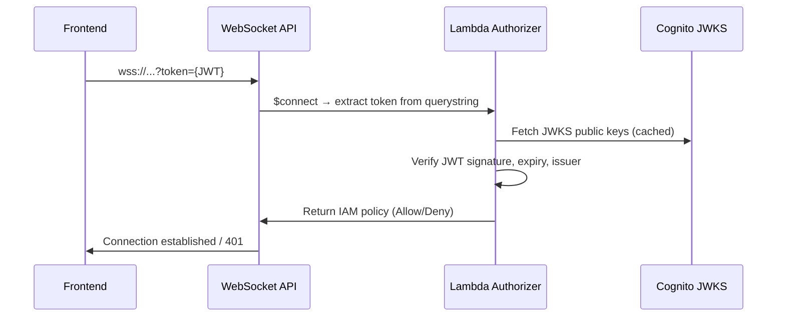
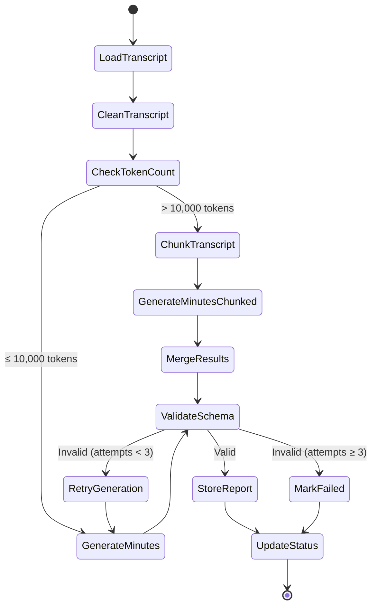

# Design Document: Meeting Minutes SaaS Application

## Overview

This docume nt describes the technical design for a production-ready Meeting Minutes SaaS application on AWS. The system captures live meeting audio from a web browser, transcribes it in near real-time using Amazon Transcribe Streaming, and generates structured meeting-minutes reports using Amazon Bedrock with Guardrails. Post-processing is orchestrated by AWS Step Functions after the transcript is available.

The architecture follows AWS Well-Architected Framework principles and operates under MZJ-IAM policies in the `ap-northeast-1` region. All resources are provisioned via Terraform and adhere to the `Pranav-meeting-minutes-{purpose}` naming convention with required tags (`User=Pranav`, `Project=meeting-minutes`).

### Key Design Principles

- **Separation of real-time and batch paths**: WebSocket streaming handles live audio/transcription; Step Functions handles post-processing only after the transcript is stored.
- **Serverless-first**: Lambda, API Gateway, Step Functions, S3, and CloudFront provide automatic scaling with no server management.
- **Least-privilege security**: Every IAM role uses the MZJTeamBoundary permissions boundary. User data is isolated by user-scoped S3 prefixes.
- **Resilience**: Raw transcripts are persisted before AI processing. Step Functions retries handle transient failures. WebSocket reconnection handles network drops.
- **Observability**: CloudWatch logging at every stage with structured log events for transcription sessions, workflow steps, and Bedrock invocations.

## Architecture

### High-Level Architecture Diagram



### Data Flow Sequence



### Component Interaction: WebSocket Authentication

API Gateway WebSocket APIs do not natively support Cognito authorizers. Authentication is handled via a Lambda authorizer on the `$connect` route that validates the JWT token passed as a query parameter.



## Components and Interfaces

### 1. Frontend Application

| Attribute | Value |
|-----------|-------|
| Framework | React / Next.js |
| Hosting | S3 + CloudFront |
| Auth Library | `@aws-amplify/auth` or `amazon-cognito-identity-js` |
| Audio Capture | Web Audio API + MediaRecorder API (PCM 16-bit, 16kHz) |
| WebSocket Client | Native WebSocket API |

**Key Responsibilities:**
- User authentication via Cognito (login/register)
- Audio capture from browser microphone
- WebSocket connection management with reconnection logic
- Live transcript display with speaker labels and partial/final segment distinction
- Report rendering with inline editing
- Export (clipboard copy, JSON download)

**API Contracts (Frontend → REST API):**

| Endpoint | Method | Auth | Description |
|----------|--------|------|-------------|
| `/meetings` | GET | JWT | List user's meetings |
| `/meetings/{meetingId}` | GET | JWT | Get meeting details + status |
| `/meetings/{meetingId}/report` | GET | JWT | Get generated report |
| `/meetings/{meetingId}/report` | PUT | JWT | Save edited report |
| `/meetings/{meetingId}/report/download` | GET | JWT | Get pre-signed URL for JSON download |
| `/meetings/{meetingId}/retry` | POST | JWT | Retry failed minutes generation |

**WebSocket Messages:**

| Direction | Action | Payload |
|-----------|--------|---------|
| Client → Server | `audio_chunk` | `{ action: "audio_chunk", data: "<base64 PCM>" }` |
| Client → Server | `stop_capture` | `{ action: "stop_capture" }` |
| Server → Client | `transcript_segment` | `{ type: "transcript", text: "...", speaker: "spk_0", isPartial: true, timestamp: "..." }` |
| Server → Client | `capture_stopped` | `{ type: "capture_stopped", meetingId: "...", status: "processing" }` |
| Server → Client | `processing_complete` | `{ type: "processing_complete", meetingId: "...", reportUrl: "..." }` |
| Server → Client | `error` | `{ type: "error", message: "...", code: "..." }` |
| Server → Client | `connection_warning` | `{ type: "connection_warning", message: "..." }` |

### 2. Authentication Service (Cognito)

| Resource | Terraform Name | Purpose |
|----------|---------------|---------|
| Cognito User Pool | `Pranav-meeting-minutes-user-pool` | User registration and login |
| Cognito App Client | `Pranav-meeting-minutes-app-client` | Frontend OAuth client (no secret) |

**Configuration:**
- Password policy: minimum 8 characters, require uppercase, lowercase, number, symbol
- Self-registration enabled
- Email verification required
- JWT token expiry: access token 1 hour, refresh token 30 days
- Standard attributes: email (required), name (optional)

### 3. API Gateway

#### REST API
| Resource | Terraform Name |
|----------|---------------|
| REST API | `Pranav-meeting-minutes-rest-api` |
| Cognito Authorizer | `Pranav-meeting-minutes-cognito-auth` |

- Cognito User Pool authorizer validates JWT on all endpoints
- CORS enabled for frontend origin
- Throttling: 1000 requests/second burst, 500 sustained

#### WebSocket API
| Resource | Terraform Name |
|----------|---------------|
| WebSocket API | `Pranav-meeting-minutes-ws-api` |
| Lambda Authorizer | `Pranav-meeting-minutes-ws-authorizer` |

- Routes: `$connect`, `$disconnect`, `audio_chunk`, `stop_capture`
- Lambda authorizer on `$connect` validates JWT from query parameter
- Connection idle timeout: 10 minutes
- Message payload limit: 128 KB (sufficient for audio chunks)

### 4. Streaming Backend

| Resource | Terraform Name | Purpose |
|----------|---------------|---------|
| WebSocket Handler Lambda | `Pranav-meeting-minutes-ws-handler` | Route WebSocket messages |
| Streaming Bridge Lambda | `Pranav-meeting-minutes-stream-bridge` | Bridge audio to Transcribe Streaming (Lambda, not ECS) |
| Connection Table (DynamoDB) | `Pranav-meeting-minutes-connections` | Track active WebSocket connections |

**Design Decision: Lambda for Streaming Bridge**

Amazon Transcribe Streaming sessions require a persistent bidirectional connection. Lambda has a 15-minute execution limit, which is sufficient for most meetings. For meetings exceeding 15 minutes, the Lambda checkpoints and restarts the Transcribe session. Lambda is chosen for simplicity, cost, and consistency with the serverless-first architecture. ECS/Fargate can be introduced as a future enhancement if longer uninterrupted sessions become a requirement.

**Streaming Bridge Lambda Configuration:**
- Runtime: Python 3.12 (AWS SDK has native Transcribe Streaming support)
- Memory: 512 MB
- Timeout: 900 seconds (15 minutes)
- Concurrency: unreserved (scales per user)
- Environment variables: `TRANSCRIPT_BUCKET`, `STEP_FUNCTION_ARN`

**Transcribe Streaming Configuration:**
- Language: `ja-JP` (Japanese) with option for `en-US`
- Media encoding: PCM (16-bit signed little-endian)
- Sample rate: 16,000 Hz
- Enable speaker diarization: `ShowSpeakerLabel = true`
- Partial results: enabled (for live captions)

### 5. Storage (Amazon S3)

| Bucket | Terraform Name | Purpose |
|--------|---------------|---------|
| Transcripts & Reports | `pranav-meeting-minutes-data` | Raw transcripts, processed transcripts, reports |
| Prompt Templates | `pranav-meeting-minutes-prompts` | Versioned prompt templates and schema files |

**S3 Key Structure:**
```
pranav-meeting-minutes-data/
├── users/
│   └── {user_id}/
│       ├── transcripts/
│       │   └── {meeting_id}/
│       │       ├── raw.json           # Raw transcript from Transcribe
│       │       └── cleaned.json       # Normalized transcript
│       └── reports/
│           └── {meeting_id}/
│               ├── minutes.json       # AI-generated report
│               └── minutes_edited.json # User-edited version (if edited)
└── meetings/
    └── {meeting_id}/
        └── status.json               # Workflow execution status

pranav-meeting-minutes-prompts/
├── prompts/
│   ├── v1/
│   │   └── minutes_prompt.txt
│   └── v2/
│       └── minutes_prompt.txt
└── schemas/
    ├── v1/
    │   └── minutes_schema.json
    └── v2/
        └── minutes_schema.json
```

**Bucket Configuration:**
- Server-side encryption: AES-256 (SSE-S3)
- Versioning: enabled on data bucket
- Lifecycle: transition to Glacier after 90 days for old reports
- Block public access: all public access blocked
- CORS: configured for frontend origin on data bucket

### 6. Post-Processing Workflow (Step Functions)

| Resource | Terraform Name |
|----------|---------------|
| State Machine | `Pranav-meeting-minutes-workflow` |
| CloudWatch Log Group | `Pranav-meeting-minutes-workflow-logs` |

**Workflow Type:** Standard (not Express) — chosen because executions may take several minutes for long transcripts and we need execution history for debugging.

**State Machine Definition:**



**Step Functions Error Handling:**
- Each Lambda task has a `Retry` block with exponential backoff:
  - `IntervalSeconds: 2`, `MaxAttempts: 2`, `BackoffRate: 2.0`
  - Error types: `Lambda.ServiceException`, `Lambda.AWSLambdaException`, `Lambda.SdkClientException`
- Schema validation failure triggers re-generation (up to 2 retries, 3 total attempts)
- Final `Catch` block on all states transitions to `MarkFailed` state
- `MarkFailed` preserves the raw transcript and logs the failure

### 7. Minutes Generator (Lambda + Bedrock)

| Resource | Terraform Name | Purpose |
|----------|---------------|---------|
| Generator Lambda | `Pranav-meeting-minutes-generator` | Invoke Bedrock with transcript |
| Bedrock Guardrail | `Pranav-meeting-minutes-guardrail` | Content safety filtering |

**Lambda Configuration:**
- Runtime: Python 3.12
- Memory: 1024 MB
- Timeout: 120 seconds
- Environment variables: `PROMPT_BUCKET`, `PROMPT_VERSION`, `GUARDRAIL_ID`, `GUARDRAIL_VERSION`, `MODEL_ID`

**Bedrock Configuration:**
- Model: `anthropic.claude-haiku-4-5-20251001-v1:0` (cost-effective for structured extraction)
- Guardrail: applied during `InvokeModel` call via `guardrailIdentifier` and `guardrailVersion` parameters
- Max tokens: 4096
- Temperature: 0.1 (low for deterministic structured output)

**Guardrail Policies:**
- Content filter: block hate, insults, sexual, violence (HIGH threshold)
- Sensitive information filter: mask PII (SSN, credit card numbers)
- No denied topics configured (meeting content is domain-agnostic)

**Prompt Template Strategy:**
- Templates stored in S3 under versioned paths
- Template includes: system instructions, output schema definition, few-shot examples
- Template variables: `{transcript}`, `{schema_version}`, `{language}`
- The prompt instructs the model to set `needs_human_review: true` when `confidence < 0.7`
- The prompt instructs the model to set fields to `null` rather than guessing

### 8. Schema Validator Lambda

| Resource | Terraform Name |
|----------|---------------|
| Validator Lambda | `Pranav-meeting-minutes-validator` |

- Validates generated JSON against the Minutes Schema using JSON Schema validation
- Checks required fields, data types, enum values (priority: low/medium/high)
- Validates confidence scores are in range [0.0, 1.0]
- Returns validation result with specific error messages for debugging

### 9. DynamoDB Connection Table

| Resource | Terraform Name |
|----------|---------------|
| DynamoDB Table | `Pranav-meeting-minutes-connections` |

| Attribute | Type | Key |
|-----------|------|-----|
| connectionId | String | Partition Key |
| userId | String | GSI Partition Key |
| meetingId | String | - |
| connectedAt | String (ISO 8601) | - |
| ttl | Number | TTL attribute |

- TTL: 24 hours (auto-cleanup of stale connections)
- On-demand capacity mode (pay-per-request)

## Data Models

### Raw Transcript (from Transcribe Streaming)

```json
{
  "meetingId": "uuid-v4",
  "userId": "cognito-sub",
  "startTime": "2024-01-15T10:00:00Z",
  "endTime": "2024-01-15T11:00:00Z",
  "language": "ja-JP",
  "segments": [
    {
      "segmentId": "seg-001",
      "speaker": "spk_0",
      "startTime": 0.5,
      "endTime": 3.2,
      "text": "それでは会議を始めましょう",
      "isPartial": false,
      "confidence": 0.95
    }
  ],
  "metadata": {
    "sampleRate": 16000,
    "encoding": "pcm",
    "transcribeSessionId": "session-id"
  }
}
```

### Cleaned Transcript

```json
{
  "meetingId": "uuid-v4",
  "userId": "cognito-sub",
  "startTime": "2024-01-15T10:00:00Z",
  "endTime": "2024-01-15T11:00:00Z",
  "language": "ja-JP",
  "totalTokenCount": 8500,
  "speakers": ["spk_0", "spk_1", "spk_2"],
  "segments": [
    {
      "speaker": "spk_0",
      "startTime": 0.5,
      "endTime": 3.2,
      "text": "それでは会議を始めましょう"
    }
  ]
}
```

### Minutes Schema (v1)

```json
{
  "$schema": "http://json-schema.org/draft-07/schema#",
  "type": "object",
  "required": ["schema_version", "meeting_title", "meeting_datetime", "participants", "summary", "agenda_items", "key_discussion_points", "decisions", "action_items", "risks_blockers", "open_questions", "follow_up_needed"],
  "properties": {
    "schema_version": { "type": "string", "pattern": "^v\\d+$" },
    "meeting_title": { "type": "string" },
    "meeting_datetime": { "type": "string", "format": "date-time" },
    "participants": {
      "type": "array",
      "items": { "type": "string" }
    },
    "summary": { "type": "string" },
    "agenda_items": {
      "type": "array",
      "items": { "type": "string" }
    },
    "key_discussion_points": {
      "type": "array",
      "items": { "type": "string" }
    },
    "decisions": {
      "type": "array",
      "items": {
        "type": "object",
        "required": ["decision", "rationale", "evidence"],
        "properties": {
          "decision": { "type": "string" },
          "rationale": { "type": "string" },
          "owner": { "type": ["string", "null"] },
          "evidence": { "type": "string" },
          "timestamp": { "type": ["string", "null"], "format": "date-time" }
        }
      }
    },
    "action_items": {
      "type": "array",
      "items": {
        "type": "object",
        "required": ["task", "priority", "evidence", "confidence", "needs_human_review"],
        "properties": {
          "task": { "type": "string" },
          "owner": { "type": ["string", "null"] },
          "due_date": { "type": ["string", "null"], "format": "date" },
          "priority": { "type": "string", "enum": ["low", "medium", "high"] },
          "evidence": { "type": "string" },
          "timestamp": { "type": ["string", "null"], "format": "date-time" },
          "confidence": { "type": "number", "minimum": 0.0, "maximum": 1.0 },
          "needs_human_review": { "type": "boolean" }
        }
      }
    },
    "risks_blockers": {
      "type": "array",
      "items": { "type": "string" }
    },
    "open_questions": {
      "type": "array",
      "items": { "type": "string" }
    },
    "follow_up_needed": { "type": "boolean" }
  }
}
```

### Meeting Status Object

```json
{
  "meetingId": "uuid-v4",
  "userId": "cognito-sub",
  "status": "pending | processing | completed | failed",
  "createdAt": "2024-01-15T10:00:00Z",
  "updatedAt": "2024-01-15T11:05:00Z",
  "stepFunctionExecutionArn": "arn:aws:states:...",
  "currentStep": "GenerateMinutes",
  "error": null,
  "transcriptKey": "users/{user_id}/transcripts/{meeting_id}/raw.json",
  "reportKey": "users/{user_id}/reports/{meeting_id}/minutes.json"
}
```

### Terraform Resource Summary

| Resource | Terraform Name | IAM Role |
|----------|---------------|----------|
| Cognito User Pool | `Pranav-meeting-minutes-user-pool` | N/A |
| REST API Gateway | `Pranav-meeting-minutes-rest-api` | N/A |
| WebSocket API Gateway | `Pranav-meeting-minutes-ws-api` | N/A |
| WS Authorizer Lambda | `Pranav-meeting-minutes-ws-authorizer` | `Pranav-meeting-minutes-ws-auth-role` |
| WS Handler Lambda | `Pranav-meeting-minutes-ws-handler` | `Pranav-meeting-minutes-ws-handler-role` |
| Stream Bridge Lambda | `Pranav-meeting-minutes-stream-bridge` | `Pranav-meeting-minutes-stream-role` |
| REST API Lambda | `Pranav-meeting-minutes-api` | `Pranav-meeting-minutes-api-role` |
| Transcript Cleanup Lambda | `Pranav-meeting-minutes-cleanup` | `Pranav-meeting-minutes-cleanup-role` |
| Transcript Chunker Lambda | `Pranav-meeting-minutes-chunker` | `Pranav-meeting-minutes-chunker-role` |
| Minutes Generator Lambda | `Pranav-meeting-minutes-generator` | `Pranav-meeting-minutes-generator-role` |
| Schema Validator Lambda | `Pranav-meeting-minutes-validator` | `Pranav-meeting-minutes-validator-role` |
| Report Storage Lambda | `Pranav-meeting-minutes-store` | `Pranav-meeting-minutes-store-role` |
| Step Functions | `Pranav-meeting-minutes-workflow` | `Pranav-meeting-minutes-sfn-role` |
| S3 Data Bucket | `pranav-meeting-minutes-data` | N/A |
| S3 Prompts Bucket | `pranav-meeting-minutes-prompts` | N/A |
| DynamoDB Connections | `Pranav-meeting-minutes-connections` | N/A |
| Bedrock Guardrail | `Pranav-meeting-minutes-guardrail` | N/A |
| CloudWatch Log Groups | `Pranav-meeting-minutes-{component}-logs` | N/A |

**All IAM roles include:**
```hcl
permissions_boundary = "arn:aws:iam::681561127010:policy/MZJTeamBoundary"
```

**All resources include:**
```hcl
tags = {
  User    = "Pranav"
  Project = "meeting-minutes"
}
```


## Correctness Properties

*A property is a characteristic or behavior that should hold true across all valid executions of a system — essentially, a formal statement about what the system should do. Properties serve as the bridge between human-readable specifications and machine-verifiable correctness guarantees.*

### Property 1: Minutes Report Serialization Round-Trip

*For any* valid Minutes_Schema-compliant report object, serializing the object to JSON and then parsing the JSON back into an object SHALL produce an object equivalent to the original.

**Validates: Requirements 17.1, 17.2, 17.3**

### Property 2: Transcript Chunking Preserves Content and Respects Limits

*For any* cleaned transcript with any number of segments and any total token count, chunking the transcript SHALL produce chunks where: (a) each chunk's token count is at most the Bedrock model's context window limit, and (b) concatenating all chunks' segments in order produces the same sequence of segments as the original transcript.

**Validates: Requirements 6.3**

### Property 3: Schema Validation Accepts Valid and Rejects Invalid Reports

*For any* JSON object that conforms to the Minutes_Schema (correct types, required fields, valid enum values, confidence in [0.0, 1.0]), the schema validator SHALL return success. *For any* JSON object that violates the schema (missing required fields, wrong types, invalid enum values, confidence outside [0.0, 1.0]), the schema validator SHALL return failure with a descriptive error.

**Validates: Requirements 6.5**

### Property 4: Confidence-Based Human Review Flagging

*For any* action item with a confidence score, if the confidence score is below 0.7 then `needs_human_review` SHALL be `true`, and if the confidence score is 0.7 or above then `needs_human_review` SHALL be `false`.

**Validates: Requirements 7.7**

### Property 5: Transcript Cleanup Preserves Meaningful Content

*For any* raw transcript containing a mix of meaningful speech segments and filler words, the cleanup function SHALL produce a normalized transcript where: (a) all meaningful speech content is preserved (no non-filler words are removed), and (b) the segment ordering is maintained.

**Validates: Requirements 6.2**

### Property 6: User-Scoped S3 Key Isolation

*For any* two distinct user IDs and any meeting IDs, the generated S3 key prefixes for their transcripts and reports SHALL have no common prefix below the `users/` level — ensuring that one user's key space never overlaps with another user's key space.

**Validates: Requirements 13.1, 15.4**

### Property 7: Report Rendering Completeness

*For any* valid decision object, the rendered output SHALL contain the decision text, rationale, and evidence snippet. *For any* valid action item object, the rendered output SHALL contain the task, priority, and confidence score. When owner or due_date is non-null, they SHALL also appear in the rendered output.

**Validates: Requirements 9.3, 9.4**

### Property 8: Speaker Label Display in Transcript Segments

*For any* transcript segment that includes a non-empty speaker label, the formatted display output SHALL contain both the speaker label and the segment text.

**Validates: Requirements 4.2**

## Error Handling

### WebSocket Connection Errors

| Error Scenario | Handling Strategy |
|---------------|-------------------|
| WebSocket connection drop during capture | Frontend displays connection-lost warning. Streaming Backend buffers received segments. Frontend attempts automatic reconnection with exponential backoff (1s, 2s, 4s, max 3 attempts). |
| Microphone access denied | Frontend displays descriptive error message explaining permission requirement. Capture button remains in idle state. |
| WebSocket authentication failure | Lambda authorizer returns 401. Frontend redirects to login page with session-expired message. |
| Audio chunk too large | WebSocket API rejects with 413. Frontend reduces chunk size and retries. |

### Transcription Errors

| Error Scenario | Handling Strategy |
|---------------|-------------------|
| Transcribe Streaming session failure | Streaming Backend logs error to CloudWatch. Attempts to restart session. If restart fails, notifies Frontend via WebSocket error message. |
| Transcribe rate limit exceeded | Streaming Backend implements exponential backoff. Logs throttling event. |
| Unsupported audio format | Streaming Backend rejects with descriptive error. Frontend displays format requirement. |

### Post-Processing Workflow Errors

| Error Scenario | Handling Strategy |
|---------------|-------------------|
| Raw transcript load failure (S3) | Step Functions retries with backoff (2s, 4s). On final failure, transitions to MarkFailed state. Raw transcript is preserved. |
| Malformed transcript JSON | Cleanup Lambda logs descriptive parse error. Workflow transitions to MarkFailed. Raw transcript preserved in S3. |
| Bedrock invocation failure | Generator Lambda retries up to 2 times with backoff. Logs error details (request ID, error message, latency). On final failure, workflow transitions to MarkFailed. |
| Bedrock Guardrail blocks content | Generator Lambda logs the guardrail intervention. Returns blocked-content error to Step Functions. Workflow transitions to MarkFailed with guardrail-blocked reason. |
| Schema validation failure | Workflow retries Minutes Generator up to 2 additional times (3 total attempts). Each retry uses the same transcript but a fresh Bedrock invocation. On final failure, transitions to MarkFailed. |
| Report storage failure (S3) | Step Functions retries with backoff. On final failure, transitions to MarkFailed. Generated report is included in the error output for manual recovery. |

### Frontend Error States

| Error Scenario | Handling Strategy |
|---------------|-------------------|
| Report loading failure | Frontend displays error message with retry button. Polls for status updates. |
| Save edits failure | Frontend displays save-failed notification. Retains edits in local state. Offers retry. |
| Export failure | Frontend displays export-failed notification. Suggests alternative export method. |
| Network offline | Frontend detects offline state. Disables capture-related actions. Displays offline indicator. |

### Step Functions Retry Configuration

All Lambda task states use the following retry configuration:

```json
{
  "Retry": [
    {
      "ErrorEquals": ["Lambda.ServiceException", "Lambda.AWSLambdaException", "Lambda.SdkClientException", "Lambda.TooManyRequestsException"],
      "IntervalSeconds": 2,
      "MaxAttempts": 2,
      "BackoffRate": 2.0,
      "JitterStrategy": "FULL"
    }
  ],
  "Catch": [
    {
      "ErrorEquals": ["States.ALL"],
      "ResultPath": "$.error",
      "Next": "MarkFailed"
    }
  ]
}
```

The `MarkFailed` state:
1. Writes a failure status object to S3 (`meetings/{meetingId}/status.json`)
2. Logs the failure details to CloudWatch
3. Preserves the raw transcript location in the status object for retry capability

## Testing Strategy

### Testing Approach

This project uses a dual testing approach combining unit tests and property-based tests for comprehensive coverage.

**Unit tests** cover:
- Specific examples and concrete scenarios
- UI component rendering and interaction
- Integration points between components
- Edge cases and error conditions
- AWS service integration verification

**Property-based tests** cover:
- Universal properties that must hold across all valid inputs
- Data transformation correctness (serialization, parsing, chunking)
- Business rule enforcement (confidence thresholds, key generation)
- Schema validation completeness

### Property-Based Testing Configuration

- **Library**: [Hypothesis](https://hypothesis.readthedocs.io/) for Python Lambda functions, [fast-check](https://fast-check.dev/) for TypeScript/React frontend
- **Minimum iterations**: 100 per property test
- **Tag format**: `Feature: meeting-minutes, Property {number}: {property_text}`

Each property test maps to a Correctness Property from this design document:

| Property | Test Location | Library | Description |
|----------|--------------|---------|-------------|
| Property 1 | `tests/unit/test_serialization.py` | Hypothesis | Minutes report JSON round-trip |
| Property 2 | `tests/unit/test_chunker.py` | Hypothesis | Transcript chunking preserves content |
| Property 3 | `tests/unit/test_validator.py` | Hypothesis | Schema validation accept/reject |
| Property 4 | `tests/unit/test_generator.py` | Hypothesis | Confidence-based review flagging |
| Property 5 | `tests/unit/test_cleanup.py` | Hypothesis | Transcript cleanup preserves content |
| Property 6 | `tests/unit/test_s3_keys.py` | Hypothesis | User-scoped S3 key isolation |
| Property 7 | `tests/frontend/report.property.test.ts` | fast-check | Report rendering completeness |
| Property 8 | `tests/frontend/transcript.property.test.ts` | fast-check | Speaker label display |

### Unit Test Coverage

| Component | Test Focus | Framework |
|-----------|-----------|-----------|
| Frontend Components | Button rendering, state transitions, user interactions | Jest + React Testing Library |
| Audio Capture Module | MediaRecorder mock, WebSocket mock, chunk encoding | Jest |
| WebSocket Authorizer Lambda | JWT validation, token expiry, malformed tokens | pytest |
| Streaming Backend Lambda | Audio forwarding, transcript buffering, S3 storage | pytest + moto |
| Transcript Cleanup Lambda | Filler word removal, formatting normalization | pytest |
| Transcript Chunker Lambda | Token counting, chunk boundary selection | pytest |
| Minutes Generator Lambda | Bedrock invocation, prompt template loading, response parsing | pytest + moto |
| Schema Validator Lambda | Valid/invalid JSON, edge cases (null fields, boundary values) | pytest |
| Report Storage Lambda | S3 write, status update | pytest + moto |

### Integration Test Coverage

| Test Scenario | Services Involved | Strategy |
|--------------|-------------------|----------|
| End-to-end audio capture | Frontend → WebSocket → Lambda → Transcribe | Mocked Transcribe, real WebSocket |
| Post-processing workflow | Step Functions → Lambda chain → S3 | LocalStack or mocked AWS services |
| Authentication flow | Frontend → Cognito → API Gateway | Mocked Cognito tokens |
| Report retrieval | Frontend → REST API → S3 | Mocked S3 with pre-signed URLs |

### Smoke Tests

| Test | Purpose |
|------|---------|
| Cognito User Pool accessible | Verify auth infrastructure |
| API Gateway endpoints respond | Verify API infrastructure |
| WebSocket API accepts connections | Verify WebSocket infrastructure |
| S3 buckets exist with correct configuration | Verify storage infrastructure |
| Step Functions state machine exists | Verify orchestration infrastructure |
| All IAM roles have MZJTeamBoundary | Verify security compliance |
| All resources tagged correctly | Verify MZJ-IAM compliance |
| Bedrock model accessible in ap-northeast-1 | Verify AI service availability |
