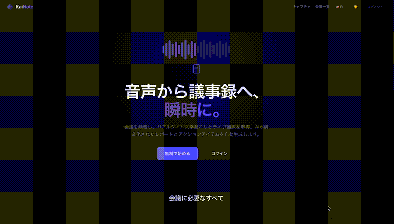

<div align="center">

<picture>
  <source media="(prefers-color-scheme: dark)" srcset="docs/images/svg/kainote-logo-dark.svg">
  <source media="(prefers-color-scheme: light)" srcset="docs/images/svg/kainote-logo-light.svg">
  
</picture>

<br/><br/>

### AI 議事録自動生成 — 音声から構造化レポートを数秒で

<br/>

[English](./README_en.md) · **日本語** · [アーキテクチャ](./infra/architecture.md) · [デプロイ手順](./infra/README.md)

</div>

<hr/>

<div align="center">
  
</div>

<br/>

**KaiNote**（会Note）は、AWS 上に構築された本番レベルの議事録 SaaS アプリケーションです。ブラウザから会議音声をキャプチャし、リアルタイム文字起こし＋ライブ翻訳を行い、Amazon Bedrock で構造化レポートを自動生成します。ポストミーティング AI エージェントが通知送信、期限超過検出、フォローアップ提案を自律的に実行します。

> 📄 **サンプルレポート:** 生成された議事録の例は [sample_report/](./sample_report/kainote_report.md) をご覧ください（Web UI スクリーンショット、Word、PDF 形式）

<br/>

## ✨ 主な機能

- 🎙️ **ライブ文字起こし** — Amazon Transcribe Streaming による話者識別付きリアルタイム音声テキスト変換
- 🌐 **ライブ翻訳** — 7言語へのリアルタイム翻訳、セッション中に切替可能
- 🤖 **AI 議事録生成** — Bedrock（Claude Haiku 4.5）が構造化レポートを生成：要約、決定事項、アクションアイテム、リスク
- 🔗 **RAG（過去会議コンテキスト）** — 直近の会議の決定事項・アクションアイテムを参照
- 📋 **ポストミーティングエージェント** — 通知自動送信、期限超過検出、フォローアップ会議提案
- 📧 **メール通知** — アクションアイテム担当者にタスク詳細・期限・コンテキスト付きメール送信
- 🗣️ **話者再帰属** — Bedrock が会話コンテキストから話者名を特定
- ✏️ **インライン編集** — 生成されたレポートをブラウザ上で直接編集
- 🌙 **ダーク / ライトテーマ** — ワンクリックでテーマ切替
- 🇯🇵 **多言語 UI** — アプリインターフェースを英語・日本語で切替
- 🔍 **検索 & フィルター** — タイトル、日付、ステータスで会議を検索
- 🔒 **セキュア** — Cognito 認証、ユーザーごとのデータ分離、最小権限 IAM、Bedrock Guardrails

<br/>

## 🛠️ 技術スタック

| レイヤー | 技術 |
|---------|------|
| フロントエンド | React / Next.js、S3 + CloudFront |
| 認証 | Amazon Cognito |
| API | API Gateway（REST + WebSocket） |
| ライブ文字起こし | ECS EC2 (t3.micro) + ALB + Transcribe Streaming |
| 翻訳 | Amazon Translate |
| AI | Amazon Bedrock（Claude Haiku 4.5）+ Guardrails |
| オーケストレーション | AWS Step Functions |
| バックエンド | AWS Lambda（Python 3.12）× 10 |
| ストレージ | Amazon S3、DynamoDB |
| 通知 | Amazon SNS |
| ネットワーク | VPC、ALB、NAT Gateway |
| IaC | Terraform（約 130 リソース） |

<br/>

## 🚀 はじめに

> 詳細なデプロイ手順: **[infra/README.md](./infra/README.md)**

```bash
cd infra && terraform init && terraform apply
./scripts/deploy-lambdas.sh
./scripts/deploy-transcription-service.sh
./scripts/deploy-frontend.sh
```

<br/>

## 📐 アーキテクチャ

> 詳細ドキュメント: **[infra/architecture.md](./infra/architecture.md)**

```
Browser → CloudFront → ALB → ECS EC2 → Transcribe Streaming
                                      → Amazon Translate（ライブ翻訳）
                                      → Bedrock（話者再帰属）
                                      → S3 → Step Functions
                                              → Cleanup → Chunker → Generator（Bedrock + RAG）
                                              → Validator → Store → Agent（Bedrock + SNS → Email）
```

<br/>

## 📂 プロジェクト構成

```
├── backend/lambdas/       10 Lambda ハンドラー（API、Generator、Agent 等）
├── services/transcription/ ECS コンテナ（Transcribe + Translate + Bedrock）
├── frontend/src/           React/Next.js アプリ（ダークテーマ、i18n）
├── infra/                  Terraform（約 20 .tf ファイル、約 130 リソース）
├── scripts/                デプロイスクリプト
└── docs/                   アーキテクチャ図、テスト音声、GIF デモ
```

<br/>

## 🏷️ 命名規則

| 規約 | 値 |
|------|-----|
| リソース命名 | `Pranav-meeting-minutes-{purpose}` |
| タグ | `User=Pranav`, `Project=meeting-minutes` |
| パーミッションバウンダリ | `MZJTeamBoundary` |
| リージョン | `ap-northeast-1` |

<br/>

<div align="center">
  <sub>AWS上に構築 ❤️ · サーバーレス · セキュア · 多言語対応</sub>
</div>
