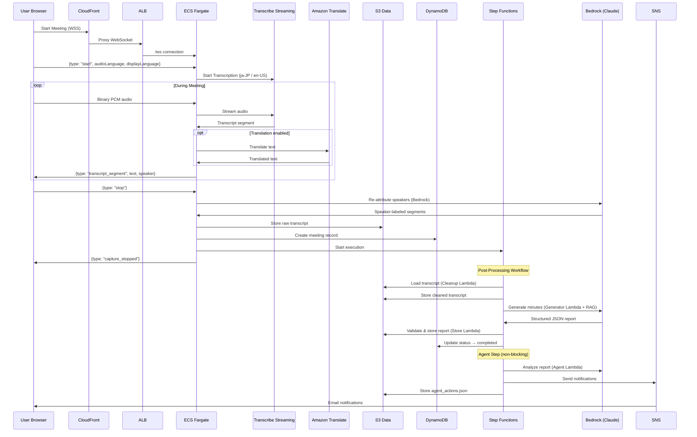
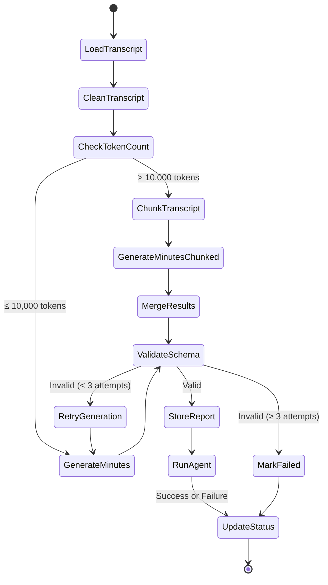

# KaiNote — Current Architecture (May 2026)

## High-Level Architecture

```mermaid
graph TB
    subgraph "Client"
        Browser[React/Next.js SPA]
    end

    subgraph "CDN & Hosting"
        CF[CloudFront Distribution]
        S3FE[S3 Frontend Bucket]
    end

    subgraph "Authentication"
        Cognito[Amazon Cognito User Pool]
    end

    subgraph "API Layer"
        RESTAPI[API Gateway REST API]
        WSAPI[API Gateway WebSocket API]
    end

    subgraph "Compute — Serverless"
        LambdaAPI[Lambda: REST API]
        LambdaWSAuth[Lambda: WS Authorizer]
        LambdaWSHandler[Lambda: WS Handler]
        LambdaStreamBridge[Lambda: Stream Bridge]
        LambdaCleanup[Lambda: Cleanup]
        LambdaChunker[Lambda: Chunker]
        LambdaGenerator[Lambda: Generator]
        LambdaValidator[Lambda: Validator]
        LambdaStore[Lambda: Store]
        LambdaAgent[Lambda: Agent]
    end

    subgraph "Compute — Containers"
        ALB[Application Load Balancer]
        ECS[ECS EC2 t3.micro: Transcription Service]
    end

    subgraph "AI/ML Services"
        Transcribe[Amazon Transcribe Streaming]
        Bedrock[Amazon Bedrock - Claude Haiku 4.5]
        Translate[Amazon Translate]
    end

    subgraph "Orchestration"
        SFN[AWS Step Functions Workflow]
    end

    subgraph "Storage"
        S3Data[S3: Data Bucket - Transcripts & Reports]
        S3Prompts[S3: Prompts Bucket - Templates & Schemas]
        DDBMeetings[DynamoDB: Meetings Table]
        DDBConnections[DynamoDB: Connections Table]
    end

    subgraph "Notifications"
        SNS[Amazon SNS: Notifications Topic]
        Email1[Email: pranavswaroopmn@gmail.com]
        Email2[Email: pranavgowda91@gmail.com]
    end

    subgraph "Observability"
        CW[Amazon CloudWatch]
    end

    subgraph "Networking"
        VPC[VPC with Public/Private Subnets]
    end

    %% Client connections
    Browser -->|HTTPS| CF
    Browser -->|REST + JWT| RESTAPI
    Browser -->|WSS via CloudFront| CF

    %% CDN
    CF --> S3FE
    CF -->|WebSocket Proxy| ALB

    %% Auth
    Browser -->|Login/Register| Cognito
    RESTAPI -->|Validate JWT| Cognito
    LambdaWSAuth -->|Verify JWT| Cognito

    %% REST API flow
    RESTAPI --> LambdaAPI
    LambdaAPI --> S3Data
    LambdaAPI --> DDBMeetings

    %% WebSocket flow (legacy, still wired but unused)
    WSAPI --> LambdaWSAuth
    WSAPI --> LambdaWSHandler
    LambdaWSHandler --> DDBConnections
    LambdaWSHandler --> LambdaStreamBridge

    %% ECS Fargate Transcription (primary path)
    ALB --> ECS
    ECS -->|Stream Audio| Transcribe
    ECS -->|Translate Segments| Translate
    ECS -->|Speaker Re-attribution| Bedrock
    ECS -->|Store Transcript| S3Data
    ECS -->|Start Workflow| SFN
    ECS -->|Create Record| DDBMeetings
    ECS --- VPC

    %% Step Functions Workflow
    SFN --> LambdaCleanup
    SFN --> LambdaChunker
    SFN --> LambdaGenerator
    SFN --> LambdaValidator
    SFN --> LambdaStore
    SFN --> LambdaAgent

    %% Generator
    LambdaGenerator -->|InvokeModel + Guardrails| Bedrock
    LambdaGenerator -->|Load Prompt| S3Prompts
    LambdaGenerator -->|RAG: Prior Reports| S3Data

    %% Store
    LambdaStore -->|Save Report| S3Data
    LambdaStore -->|Update Status| DDBMeetings

    %% Agent
    LambdaAgent -->|Analyze Report| Bedrock
    LambdaAgent -->|Load Prompt| S3Prompts
    LambdaAgent -->|RAG: Prior Reports| S3Data
    LambdaAgent -->|Store Actions| S3Data
    LambdaAgent -->|Send Notifications| SNS

    %% SNS
    SNS --> Email1
    SNS --> Email2

    %% Observability
    ECS -.->|Logs| CW
    SFN -.->|Logs| CW
    LambdaGenerator -.->|Logs| CW
    LambdaAgent -.->|Logs| CW
```

## Data Flow Sequence

## Step Functions Workflow

## AWS Resources Summary

| Category | Resource | Name |
|----------|----------|------|
| **CDN** | CloudFront | Distribution (SPA + WSS proxy) |
| **Hosting** | S3 | pranav-meeting-minutes-frontend |
| **Auth** | Cognito | Pranav-meeting-minutes-user-pool |
| **API** | API Gateway REST | Pranav-meeting-minutes-rest-api |
| **API** | API Gateway WebSocket | Pranav-meeting-minutes-ws-api |
| **Compute** | Lambda × 10 | ws-authorizer, ws-handler, stream-bridge, api, cleanup, chunker, generator, validator, store, agent |
| **Compute** | ECS Fargate | Pranav-meeting-minutes-transcription |
| **Compute** | ALB | Pranav-meeting-minutes-transcription-alb |
| **AI/ML** | Bedrock | Claude Haiku 4.5 (JP inference profile) |
| **AI/ML** | Bedrock Guardrail | Pranav-meeting-minutes-guardrail |
| **AI/ML** | Transcribe Streaming | Real-time (en-US, ja-JP, etc.) |
| **AI/ML** | Translate | Real-time segment translation |
| **Orchestration** | Step Functions | Pranav-meeting-minutes-workflow |
| **Storage** | S3 | pranav-meeting-minutes-data |
| **Storage** | S3 | pranav-meeting-minutes-prompts |
| **Storage** | DynamoDB | Pranav-meeting-minutes-meetings |
| **Storage** | DynamoDB | Pranav-meeting-minutes-connections |
| **Notifications** | SNS | Pranav-meeting-minutes-notifications |
| **Networking** | VPC | Pranav-meeting-minutes-vpc |
| **Networking** | ECR | Pranav-meeting-minutes-transcription |
| **Observability** | CloudWatch | Log groups for all components |
